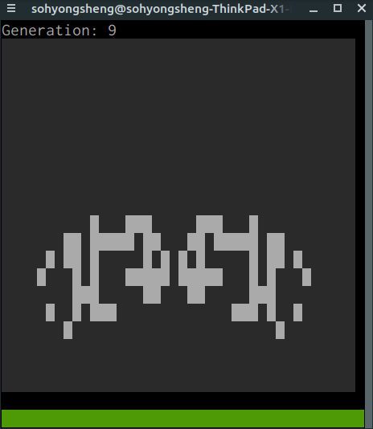
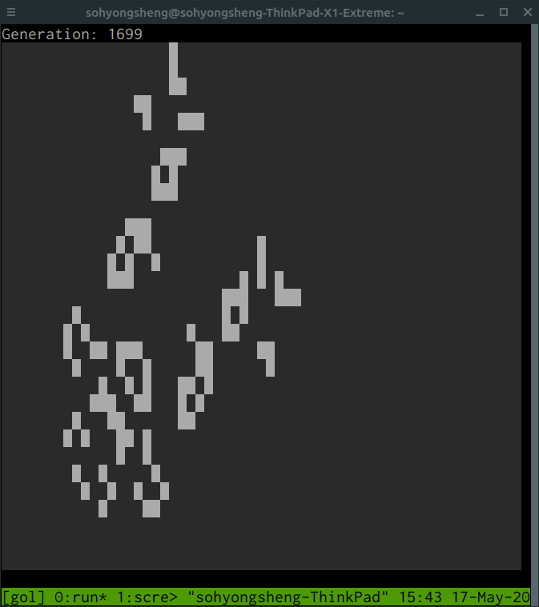

# Conway's Game of Life

This program runs Conway's Game of Life (GOL) in terminal, with a curses-like UI. If you don't know what GOL is, check out these links.

- [Wikipedia article](https://en.wikipedia.org/wiki/Conway%27s_Game_of_Life)
- [LifeWiki](https://conwaylife.com/wiki/Main_Page) for cool seeds and information.

## Screencasts

Spider: 



Lobster:



## Prerequisites

- Python 3.6.9 or higher.
- No need to install any extra Python packages, this runs on Python's standard library.

## Play

You can begin by running something like this.

```
python3 play.py -w -p seeds/spaceships/spider.txt
```

This means begin playing by running the seed text file `seeds/spaceships/spider.txt`, on a board with wrap-around.

Press `Ctrl`+`C` to exit the program.

For all options, see help message.

```
python3 play.py -h
```

## Tests

To run tests, first install required packages.

```
pip3 install -r requirements.txt
```

Then run this.

```
pytest tests
```

## RIP

[John Conway](https://en.wikipedia.org/wiki/John_Horton_Conway#cite_note-dailyvoice-46) died of complications from COVID-19 on 11 April 2020, at age 82. This project is made in remembrance of him.

